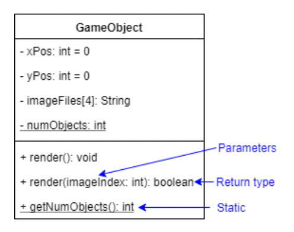

# Introduction 
## OOSD 
An object is an instance of a class. 

Object Oriented Software Development (OOSD) is the use of object methods to turn inputs into outputs. 

## Java 
Java is 
* object oriented 
* platform independent 
* compiled and interpreted 

# Types  
## Identifiers 
An identifier is a name that uniquely identifies a 
* class 
* object 
* variable 
* method 

Identifiers 
* must not start with a digit 
* can have letters, digits, and underscores 
* are case sensitive 

```java
int SPEED_LIMIT = 100;
int SPEED = 70;
int speed = 60;
```

## Variables 
A variable is a pointer to an object with 
* memory address 
* type 

Variables must be initialised before use. 
```java
int age = 20;
``` 

## Constants 
Constants can only be set once. 

```java 
static final int MAX_SCORE = 100;
```

A `final class` cannot be extended. 

## Primitive Types 
Primitive types have no methods. 

 

Each primitive type has a wrapper classes with methods. 

 

```java 
int heightA = 180; 
Integer heightB = 190;

String heightC = heightB.toString();
int heightDigits = heightB.length();
``` 

## Boxing and Unboxing 
Boxing is converting a primitive value to a wrapper object. 

Unboxing is converting a wrapper object to a primitive value. 

## Type Casting 
```
byte < short < int < long < float < double 

char < int 

boolean 
```

Values can be assigned to a wider type. 

```java 
float a = 2;
double b = 3.14f;
``` 

Values must be explicitly **cast** to a narrower type. 

```java 
int a = (int) 2.5;
float b = (float) 2.5;
``` 

## Division 
Division with two integers returns integer floor division. 

```java 
double a = 5 / 3 // = 1 
``` 

Division with at least one real value (float or double) returns a real value. 

```java 
double a = 5 / (double) 3 // = 1.66... 
``` 

# Methods 
A method is a function in a class. 

All non `void` methods must `return` a value. 

## Method Signature 
The signature of a method includes the number and type of its arguments. 

```java 
public static double product(double a, double b) {
    return a * b;
}
``` 

## Overloading 
Overloading is having many methods with the same name but different number or type of arguments (different signatures). 

```java 
public static double product(double a, double b) {
    return a * b;
}

public static double product(int a, int b, int c) {
    return a * b * c;
}
``` 

## Overriding 
Overriding is having a subclass method with the same name and arguments (same method signature) as a superclass method, but a different method body. 

Subclasses can **override** superclass methods. 

# Classes 
A class is a type with attributes and methods. 

An object is an instance of a class.  

```java 
class Circle {
    // Attributes 
    // Methods 
}
```

## Static vs Instance 
**Static** attributes and methods belong to the class, and are shared by all instances of the class. 

**Instance** attributes and methods are unique to each instance of a class. 

```java 
class Circle {
    private static int numCircles = 0;

    private Point center;
    private double radius;
}
```

## Static Methods 
All methods independent of instance variables should be static. 

## Constructors 
A constructor is an instance method that initialises an object. 

The `this` keyword is the current object. 

Constructors can be **overloaded**. 

```java 
class Circle {
    private static int numCircles = 0;

    private Point center;
    private double radius;

    public Circle(Point center, double radius) {
        this.center = center;
        this.radius = radius;
    }
}
``` 

## Copy Constructors 
A copy constructor takes an object as an argumet, and creates an independent copy of the object. 

If instance attributes **reference** other objects, independent copies of the referenced objects must also be created. 

```java 
class Circle {
    private static int numCircles = 0; 

    Point center;
    double radius;

    public Circle(Circle aCircle) {
        numCircles += 1; 

        // Independent copy of referenced object 
        this.center = new Point(aCircle.center);

        this.radius = aCircle.radius;
    }
}
``` 

## Null 
Variables have value **null** (no object here) until set. 

```java 
Circle circleA;
``` 

## Object Instantiation 
The `new` keyword allocates memory for an object. 

```java 
Circle aCircle = new Circle(new Point(2, 3), 5);
``` 

## Getters and Setters 
**Getters** return private attributes. 

**Setters** set private attribues. 

```java 
class Circle {
    private static int numCircles = 0;

    private Point center;
    private double radius;

    public static int getNumCircles() {
        return this.numCircles;
    }

    public Circle(Point center, double radius) {
        numCircles += 1;

        this.center = center;
        this.radius = radius;
    }

    public double getRadius() {
        return this.radius;
    }

    public void setRadius(double radius) {
        this.radius = radius;
    }
}
``` 

# Standard Methods 
All classes inherit the **Object** class, with methods 
* equals 
* toString 

```java 
class Object {
    public boolean equals(T other) {
        return <isEqual>; 
    }

    public String toString() {
        return <aString>; 
    }
}
``` 

# Standard Input 
A `scanner` can read input from `System.in`. 

```java 
Scanner s = new Scanner(System.in);
```

```java 
// Returns current line and move to start of next line 
System.out.println("Enter your name: ");
String name = s.nextLine(); 
``` 

```java 
// Returns next double and moves to end of double 
System.out.println("Enter your height: ");
Double height = s.nextDouble(); 

// Returns rest of line and moves to start of next line 
String restOfLine = s.nextLine();
``` 

# File Input 
A `BufferedReader` can read a file. 

```java 
// Create new BufferedReader 
BufferedReader br = new BufferedReader(new FileReader("foods.csv"));
``` 

```java 
// Read file 
String line = null;

while ((line = br.readLine()) != null) {
    // Split line 
    String cells[] = line.split(",");

    // Use line cells 
}
``` 

# Privacy 
## Information Hiding 
Information hiding is making attributes and methods visible in their class, and invisible to external classes. 

All **non final** attributes should be private. 

## Privacy Levels 
**Private** attributes and methods can only be used in the same class. 

**Protected** attributes and methods can be used in the same package and in subclasses. 

**Public** attributes and methods can be used anywhere (global scope). 

## Privacy Leaks 
A privacy leak is when a reference to a private attribute is made avaiable (leaked) to an external object. 

## Mutable Objects 
An object is **mutable** if its attributes can be changed (mutated) after initialisation. 

## Immutable Objects 
An object is **immutable** if it has 
* only private attribues 
* no setters 

# Inheritance 
A subclass can **extend** a superclass. 

The subclass inherits all 
* public 
* protected 

attributes and methods of the superclass. 

## Super 
`super()` calls the constructor of the superclass. 

`super.` allows for superclass member access. 

```java 
class Shape {
    private Point center;

    public Shape(Point center) {
        this.center = center;
    }

    public double getArea() {
        return 0;
    }
}

class Circle extends Shape {
    private double radius; 

    public Circle(Point center, double radius) {
        super(center); 

        this.radius = radius; 
    }

    public double getArea() {
        return Math.PI * radius * radius; 
    }
}
``` 

## Access Control 
A subclass cannot increase the privacy of a superclass method. 

## Get Type 
`getClass()` returns a class object. 

`instanceof` returns true if an object is an instance of a class. 

```java 
aCircle.getClass();
aCircle instanceof Circle == true; 
``` 


## Upcasting 
Upcasting is assigning a subclass object to a superclass variable. 

```java 
Shape aCircle = new Circle();
``` 

## Downcasting 
Downcasting is explicitly **casting** a superclass variable, and assigning it to a subclass variable. 

The superclass variable must reference an object of the subclass. 

```java 
Shape aCircle = new Circle();
Circle sameCircle = (Circle) aCircle;
``` 

## Abstract Methods 
Abstract methods are methods with no implementation (body). 

Abstract methods must be overriden by a subclass to be used. 

## Abstract Classes 
Abstract classes have zero or more abstract methods. 

Abstract classes have no instances. 

# Interfaces 
Interfaces are abstract classes with only 
* static final attributes 
* abstract methods 

A subclass can **implement** an interface, and must override all abstract methods from the interface. 

```java 
interface Consumable {
    
    public void consume();
}

class WaterBottle implements Consumable {
    private double volume; 

    public WaterBottle(double volume) {
        this.volume = volume;
    }

    // Override 
    public void consume() {
        this.volume = this.volume / 2;
    }
}
``` 
A subclass can **implement** many interfaces. 

```java 
class WaterBottle implements Drinkable, Evaporatable 
``` 

A sub interface can **extend** many super interfaces. 

```java 
interface Drinkable extends Consumable, Freezable {

    public void drink(); 
}
``` 

## Comparable Interface 
The comparable interface is generic with method 
* compareTo 

```java 
interface Comparable<T> {
    
    public int compareTo(T other);
}
``` 

# Generics 
A generic is a class or method that takes a type parameter `T`. 

```java 
class Book<T> {
    int numPages;
    ArrayList<T> pages = new ArrayList<>();
}
``` 

## Collections 
A collection is a set of elements. 

```java 
interface Collection<T> {

    public int size();

    public boolean add(T element);
    public boolean remove(T element);

    public boolean contains(T element);
}
``` 

## Lists 
A list is an indexed collection. 

```java 
interface List<T> extends Collection<T> {

    public T get(int i);
    public void set(int i, T element);
}
``` 

## Maps 
A map is a set of key value pairs. 

```java 
interface Map<K, V> {

    public int size();

    public boolean put(K key, V value);
    public boolean remove(K key);

    public boolean containsKey(K key);
    public boolean containsValue(V value);

    public V get(K key);
}
``` 

## Arrays 
* Fixed size 
* Manual resizing 

```java 
Circle circles[] = new Circle[numCircles];
``` 

## ArrayLists 
**Advantages** 
* Automatic size increasing 
* Insert, remove, update at any index 

**Disadvantages** 
* Manual size decreasing with `trimToSize()` 

```java 
ArrayList<T> scores = new ArrayList<>();

// ArrayList for each 
for (T score : scores) {
    // Use score 
}
``` 

# OOSD Foundations 
## Abstraction 
Abstraction is use of classes as Abstract Data Types (ADT). 

## Encapsulation 
Information hiding is making the internal attributes and methods of a class invisible to external classes. 

Encapsulation is grouping of attributes and methods in a single class, and control over access and mutation of class attributes through use of getters and setters. 

## Polymorphism 
Many forms. 

## Inheritance 

# UML Class Models 

## Classes 
A class has 
* name 
* attributes 
* methods 

## Class Attributes 
A class attribute has 
* name 
* privacy (private -) 
* static 
* type (int) 
* multiplicity (array length) 

 

## Class Methods 
A class method has a 
* name 
* privacy (public +) 
* static 
* return type (void) 
* parameters 

 

## Class Relationships 
* Association 
* Generalisation (`extends`) 
* Realisation (`implements`) 
* Dependency 

## Association 
A class having an external class as an attribute, through 
* aggregation 
* composition 

Associations have a **multiplicity**. 

 

* Student has 1 to 5 courses 
* Course has 10 to 400 students 
* Student has 1 student as a representative 

## Aggregation 

 

* Duck has 0 to 1 pond (duck does not require pond) 
* Pond has 0 to many ducks 

## Composition 

 

* Department has 1 university (department requires university) 

## Generalisation 
A subclass `extends` a superclass. 

A superclass can be **abstract** (italic). 

 

* Player is a character (abstract class) 

## Realisation 
A class `implements` an interface. 

 

* Player is moveable and targetable (<\<interface\>>) 

## Dependency 
A class having an external class as a method parameter. 

 

* Player has position as a method parameter 

# Design Patterns 
A design pattern has 
* intent 
* motivation 
* applicability 
* structure (UML) 
* participants (classes used) 
* collaboration (between classes) 
* consequences 
* implementation 
* known uses 

A design pattern can be for object 
* creation 
* structure 
* behaviour 

## Singleton Classes 
A singleton class has at most one instance. 

```java 
class Singleton {

    private static Singleton theSingleton;

    // Private constructor 
    private Singleton() {
        
    }

    // Singleton access 
    public static Singleton getTheSingleton() {

        if (theSingleton == null) {

            // Create the singletion 
            theSingleton = new Singleton();
        }

        return theSingleton;
    }
}
``` 

## Factory Methods 
An abstract `creator` has an abstract factory method `createProduct()` that returns an abstract `product`. 

A `sub creator` can override `createProduct()` to return a `sub product`. 

```java 
// Product 
abstract class Player {}

// Creator 
abstract class Game {

    // Factory method 
    public Player createPlayer();
}

class RPGPlayer extends Player {}

class RPGGame extends Game {

    public Player createPlayer() {

        return new RPGPlayer();
    }
}
``` 

## Template Classes 
An abstract `template` has a concrete `doAction()` that calls abstract helper methods. 

A subclass can `extend` the `template` to use `doAction()`. 

```java 
// Template 
abstract class Quicksorter {

    protected int length;

    // Actions 
    public void quicksort(int left, int right) {
        
        if (left >= right) {
            return;
        }

        int mid = this.split(left, right);
        
        this.quicksort(left, mid - 1);
        this.quicksort(mid + 1, right);
    }

    public int split(int left, int right) {
        // A[right] is pivot 

        int finalIndex = left;

        for (int i = left; i <= right; i++) {

            if (this.compare(i, right) < 0) {

                this.swap(i, finalIndex);
                finalIndex += 1;
            }
        }

        return finalIndex;
    }

    // Helper methods 
    public int compare(int iA, int iB);
    public void swap(int iA, int iB);
}

class IntQuicksorter extends Quicksorter {

    private ArrayList<Integer> A;

    public IntQuicksorter(ArrayList<Integer> A) {
        
        this.A = A;
        this.length = A.size();
    }

    public ArrayList<Integer> getA() {
        return this.A;
    }

    // Helper implementations 
    public int compare(int iA, int iB) {

        return Integer.compare(this.getA().get(iA), 
        this.getA().get(iB));
    }

    public void swap(int iA, int iB) {

        int swap = this.getA().get(iA);
        this.getA().set(iA, this.getA().get(iB));
        this.getA().set(iB, swap);
    }
}
``` 

## Strategy Interfaces 
A `player` uses a `strategy` as an attribute. 

The `strategy` interface is implemented by concrete strategies. 

```java 
// Player 
class Player {

    private Strategy strategy;

    public Player(Strategy strategy) {
        
        this.strategy = strategy;
    }

    public void playStrategy() {

        // Play strategy 
    }
}

interface Strategy {
    
    public void attack();
    public void move();
}

class StrategyA implements Strategy {

    public void attack() {

        // Implement attack 
    }

    public void move() {

        // Implement move 
    }
}
``` 


## Observer Classes 
An abstract `target` has a list of `observers`. 

An interface `observer` responds to a change in state of the `target` with an abstract `update()`. 

```java 
// Target 
abstract class Target {

    private ArrayList<Observer> observers = new ArrayList<>();

    private notifyObservers() {

        // Update each observer 
        for (Observer observer : this.observers) {

            observer.update();
        }
    }

    public ArrayList<Observer> getObservers() {
        return this.observers;
    }
}

// Observer 
interface Observer {

    public void update();
}

class Bus extends Target {} 

class Person implements Observer {

    public void update() {

        // Implement update 
    }
}
``` 

# Exceptions 
An exception is thrown by a runtime error or an invalid state. 

```java 
class FrozenException extends Exception {

    public FrozenException() {

        super("A bit frozen, good luck drinking it");
    }

    public FrozenException(String message) {

        super(message);
    }
}
``` 

## Checked Exceptions 
Checked exceptions must be handled. 

## Unchecked Exceptions 
Unchecked exceptions may be left unhandled. 

## Throwing Exceptions 
Method signatures must include the exceptions they throw. 

```java 
public class Can implements Drinkable {
    
    private String name;
    private double volume;
    private double temperature;

    public Can(String name, double volume, double temperature) {

        this.name = name;
        this.volume = volume;
        this.temperature = temperature;
    }

    public Can(String name) {

        this.name = name;
        this.volume = DEFAULT_VOLUME;
        this.temperature = DEFAULT_TEMPERATURE;
    }

    public String getName() {
        return this.name;
    }

    public double getVolume() {
        return this.volume;
    }

    public double getTemperature() {
        return this.temperature;
    }

    public void setName(String name) {
        this.name = name;
    }

    public void setVolume(double volume) {
        this.volume = volume;
    }

    public void setTemperature(double temperature) {
        this.temperature = temperature;
    }

    // Exceptions thrown 
    public void drink() throws FrozenException, Exception {

        // Check temperature 
        if (this.getTemperature() <= 0) {
            throw new FrozenException();
        }

        if (this.getVolume() <= 0) {
            throw new Exception("Can empty");
        }

        this.setVolume(0);
        System.out.println("Drinkable drank");
    }
}
``` 

## Chaining Exceptions 
Exceptions thrown by called methods must be handled. 

```java 
public class Main {

    public static void main(String[] args) {

        // Create can 
        Can aCan = new Can("Monster Zero Ultra", 500, 10);

        // Drink can 
        try {
            
            aCan.drink();

            aCan.setTemperature(-10);

            aCan.drink();
        } catch (FrozenException e) {
            
            System.out.println(e.getMessage());
        } catch (Exception e) {

            System.out.println(e.getMessage());
        }
    }
}
``` 

